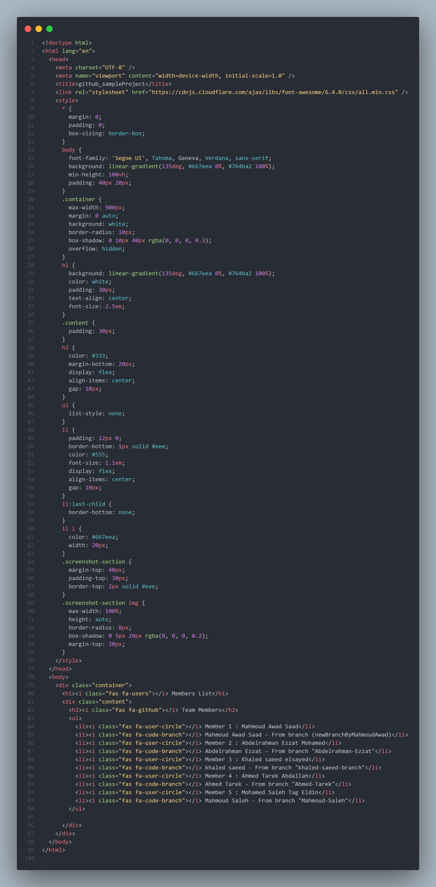

# 🚀 GitHub Sample Project

## 📌 Overview

This is a **GitHub sample project** that demonstrates 👥 **team collaboration**, 🌿 **multiple branches**, and 🔀 **pull request workflows**.

---

## 👨‍💻 Team Members

The project includes contributions from the following team members:

- 🧑‍💻 **Mahmoud Awad Saad**  
  🌿 Branch: `newBranchByMahmoudAwad`

- 🧑‍💻 **Abdelrahman Ezzat Mohamed**  
  🌿 Branch: `Abdelrahman-Ezzat`

- 🧑‍💻 **Khaled Saeed Elsayed**  
  🌿 Branch: `khaled-saeed-branch`

- 🧑‍💻 **Ahmed Tarek Abdallah**  
  🌿 Branch: `Ahmed-Tarek`

- 🧑‍💻 **Mohamed Saleh Tag Eldin**  
  🌿 Branch: `Mahmoud-Saleh`

---

## ⚙️ Getting Started

1. 📥 Clone the repository
2. 🌿 Switch between branches to explore each member’s work
3. 🌐 Open `index.html` in your browser to view the members list

---

## 🤝 Contributing

Each team member works on a **separate branch** to keep changes organized:

- 🌱 Use your assigned branch
- ✏️ Make your changes
- 🔀 Open a Pull Request for review

---

## 📜 License

📚 This project is created for **educational purposes** only.

---

## 🖼️ Screenshot

✨ _Preview of the project structure and implementation_
